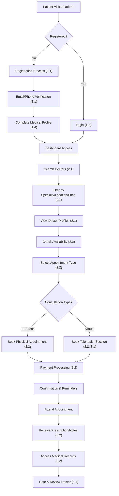
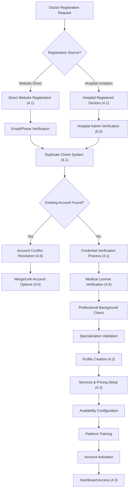
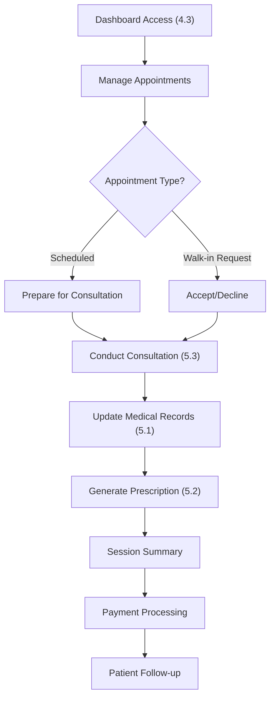
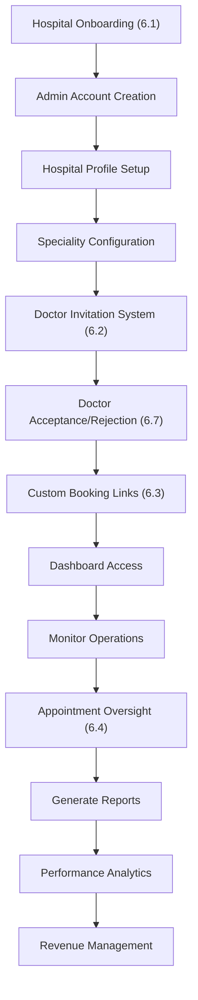
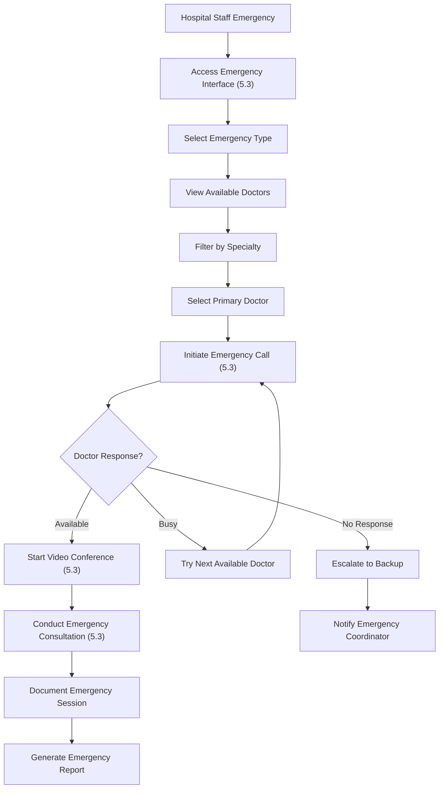
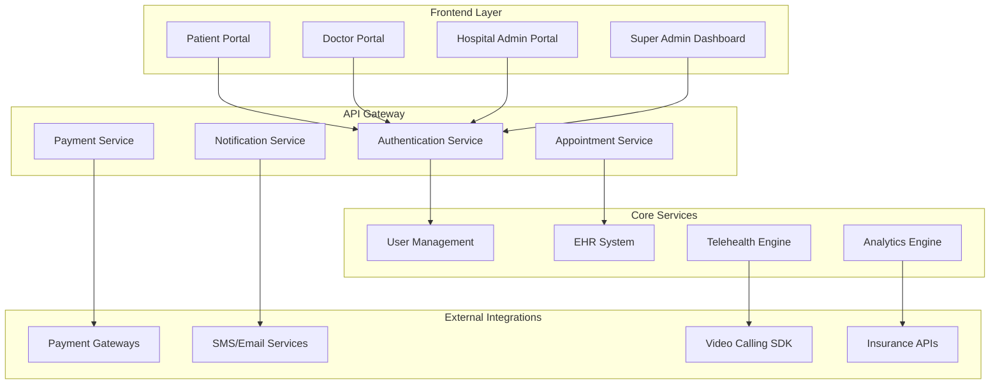

***

# Mediverse Platform Requirements Document

**Version 2.0 - Post August 1st Meeting Update**

> **IMPORTANT NOTICE FOR DR. USMAN**: This document has been updated following our August 1st meeting. Please review each section carefully and provide detailed feedback via Notion comments. Once development begins, major functionality changes will significantly impact timelines. Your thorough review now is critical for project success.

***

## 1. Project Overview

### 1.1 Meeting Summary (August 1, 2024)

**Key Outcomes:**

* Core functionalities and execution approach finalized

* Technical document simplified into visual, easily understandable format

* User journeys and workflows presented with flowcharts

* Notion commenting system established for detailed feedback

* Development timeline dependencies on stakeholder approval confirmed

**Critical Action Required:**

* Dr. Usman to provide comprehensive feedback via Notion comments

* All major functionalities must be approved before development starts

* Any post-development changes will cause significant timeline delays

### 1.2 Core Value Propositions

**For Doctors:**

* Complete autonomy over schedule and pricing

* Integrated practice management tools

* Direct patient communication channels

* Revenue optimization through dynamic pricing

**For Patients:**

* Transparent doctor selection with reviews and ratings

* Flexible appointment booking (in-person/virtual)

* Comprehensive health record access

* Competitive pricing through marketplace dynamics

**For Healthcare Institutions:**

* White-label solutions for hospital-specific portals

* Analytics and reporting

* Staff and resource management tools

***

## 2. User Roles & Permissions

### 2.1 Core User Roles

| Role               | Primary Functions                                    | Access Level         | Registration Method                        |
| ------------------ | ---------------------------------------------------- | -------------------- | ------------------------------------------ |
| **Patient**        | Book appointments, access records, consultations     | Standard User        | Email/Phone verification                   |
| **Doctor**         | Manage practice, conduct consultations, patient care | Professional User    | Invitation-based + credential verification |
| **Hospital Admin** | Manage hospital operations, staff oversight          | Administrative       | Hospital onboarding process                |
| **Super Admin**    | Platform management, hospital oversight              | System Administrator | Internal assignment                        |

***

## 3. User Journeys & Workflows

> **REVIEW INSTRUCTION FOR DR. USMAN**: Each flowchart node below corresponds to specific features in our development database. Please verify that these workflows align with your clinical practice expectations and comment on any missing steps or incorrect sequences.

### 3.1 Flowchart-to-Feature Mapping

**Epic Alignment with User Journeys:**

| Flowchart Section          | Corresponding Epic                          | Features Database Reference |
| -------------------------- | ------------------------------------------- | --------------------------- |
| Patient Registration/Login | Patient Authentication & Profile Management | Epic 1.1-1.4                |
| Doctor Search & Booking    | Doctor Discovery & Appointment Booking      | Epic 2.1-2.3                |
| Telehealth Sessions        | Telehealth & EHR Access                     | Epic 3.1-3.3                |
| Doctor Operations          | Doctor Portal & Patient Management          | Epic 4.1-4.8                |
| Hospital Management        | Hospital Administration & Emergency         | Epic 5.1-5.4                |

### 3.2 Patient Journey



### 3.3 Doctor Journey & Comprehensive Onboarding

> **CRITICAL REVIEW FOR DR. USMAN**: The doctor onboarding system below implements our doctor-centric single account model. Please verify this aligns with real-world doctor registration scenarios and hospital affiliation processes.

### 3.3.1 Enhanced Doctor Onboarding Flow (Epic 4.1-4.8)



### 3.3.2 Doctor Operational Journey (Epic 4.3-4.4)



### 3.3.3 Doctor Onboarding Requirements & Duplicate Prevention

### A. Complete Doctor-Only Onboarding System

**Core Principle**: Mediverse implements a **Doctor-Centric Registration Model** where doctors maintain singular, verified accounts regardless of their affiliation with multiple hospitals or direct platform registration.

**Registration Channels:**

1. **Direct Website Registration**: Doctors self-register through the platform
2. **Hospital-Sponsored Registration**: Hospitals invite doctors to join their network
3. **Referral-Based Registration**: Existing doctors refer colleagues

### B. Duplicate Registration Prevention Strategy

**Primary Identification Matrix:**

```
Doctor Uniqueness Verification:
├── Medical License Number (Primary Key)
├── National ID/SSN (Secondary Key)
├── Email Address (Tertiary Key)
├── Phone Number (Quaternary Key)
└── Full Name + Date of Birth (Fallback)
```

**Duplicate Detection Algorithm:**

1. **Real-time Check**: During registration, system performs instant lookup
2. **Fuzzy Matching**: Handles variations in name spelling, formatting
3. **Cross-Reference Validation**: Checks against medical board databases
4. **Manual Review Queue**: Flagged cases require admin verification

### C. Conflict Resolution Framework

**Scenario 1: Doctor Registered via Website, Hospital Attempts Re-registration**

**System Response:**

* **Immediate Block**: Prevent duplicate account creation

* **Notification**: Alert hospital admin of existing account

* **Linking Process**: Offer to link doctor to hospital network

* **Doctor Consent**: Require doctor approval for hospital affiliation

**Pros:**
✅ Maintains data integrity and prevents confusion
✅ Preserves doctor’s existing patient relationships
✅ Reduces administrative overhead
✅ Ensures consistent patient experience
✅ Prevents revenue splitting conflicts

**Cons:**
❌ May delay hospital onboarding process
❌ Requires additional verification steps
❌ Potential friction between hospital and doctor
❌ Complex consent management

**Scenario 2: Hospital-Registered Doctor Attempts Direct Registration**

**System Response:**

* **Account Recognition**: Identify existing hospital-linked account

* **Upgrade Path**: Offer to convert to independent account

* **Hospital Notification**: Inform hospital of doctor’s independence request

* **Transition Period**: Allow gradual migration of appointments/data

**Pros:**
✅ Supports doctor autonomy and career mobility
✅ Maintains platform relationship regardless of hospital changes
✅ Enables independent practice opportunities
✅ Preserves patient continuity

**Cons:**
❌ May create tension with hospital partners
❌ Complex data migration requirements
❌ Potential revenue impact for hospitals
❌ Requires careful contract management

### Edge Cases & Solutions

**Edge Case 1: Doctor with Multiple Medical Licenses (Multi-State Practice)**

**Problem**: Doctor licensed in multiple states may appear as different practitioners

**Solution:**

* **Primary License Designation**: Doctor selects main practicing license

* **Secondary License Linking**: Additional licenses linked to primary account

* **State-Specific Profiles**: Separate practice profiles per state

* **Unified Billing**: Single payment account across all states

**Edge Case 2: Doctor Name Changes (Marriage, Legal Name Change)**

**Problem**: Legal name changes may create false duplicates or prevent account access

**Solution:**

* **Name Change Verification**: Legal document upload requirement

* **Alias Management**: Maintain record of previous names

* **Medical Board Sync**: Update with licensing authorities

* **Patient Notification**: Inform existing patients of name change

**Edge Case 6: Doctor Account Inheritance (Death/Incapacitation)**

**Problem**: Managing doctor accounts when practitioner cannot continue

**Solution:**

* **Estate Management Process**: Legal heir account transfer

* **Patient Record Transition**: Secure transfer to designated successor

* **Appointment Cancellation**: Automated patient notification system

* **Data Retention Compliance**: HIPAA-compliant record preservation

### 3.4 Hospital Admin Journey

> **REVIEW FOR DR. USMAN**: Please verify this hospital administration workflow matches your experience with hospital operations and doctor management processes.



### 3.5 Emergency Consultation System (Hospital-Exclusive)

> **EMERGENCY WORKFLOW REVIEW FOR DR. USMAN**: This emergency system is designed for critical situations. Please verify the workflow matches hospital emergency protocols and comment on response time requirements.

**Overview:**
A dedicated emergency consultation feature exclusively available to hospitals for urgent medical situations. This system provides immediate access to available doctors through a streamlined interface designed for time-critical scenarios.

**Core Requirements:**

### 3.5.1 Emergency Call Interface

* **Dedicated Emergency Screen**: Separate interface accessible only to hospital staff

* **One-Click Access**: Prominent emergency button on hospital dashboard

* **Priority Routing**: Automatic routing to available emergency-qualified doctors

* **Instant Notifications**: Real-time alerts to all available doctors

* **Emergency Code Integration**: Support for hospital emergency codes and protocols

### 3.5.2 Available Doctor Selection

* **Real-Time Availability**: Live status of doctors (available/busy/offline)

* **Specialty Filtering**: Filter doctors by emergency specialties (ER, ICU, Cardiology, etc.)

* **Response Time Display**: Show average response time for each doctor

* **Priority Ranking**: Rank doctors by emergency experience and availability

* **Backup Options**: Secondary doctor suggestions if primary choice unavailable

### 3.5.3 Emergency Video Conferencing

* **Instant Connection**: Sub-10 second connection time

* **High Priority Bandwidth**: Dedicated bandwidth allocation for emergency calls

* **Multi-Participant Support**: Include multiple doctors, nurses, and specialists

* **Screen Sharing**: Share patient monitors, X-rays, and medical data

* **Session Recording**: Automatic recording for medical records and legal purposes

* **Mobile Compatibility**: Full functionality on mobile devices for on-call doctors

**Technical Specifications:**

### 3.5.4 Emergency Workflow



## 4. Core Application Flow

***

### 4.1 System Architecture Overview



### 4.2 Data Flow Architecture

1. **Authentication Flow**: Multi-factor authentication with role-based access control
2. **Appointment Flow**: Real-time availability checking with conflict resolution
3. **Payment Flow**: Secure payment processing with escrow for dispute resolution
4. **Communication Flow**: HIPAA-compliant messaging and video consultations
5. **Data Sync Flow**: Real-time synchronization across all user interfaces

***

## 5. Integration Points

### 5.1 Payment Gateway Integration

**Primary Requirements:**

* Multi-currency support

* Subscription management for hospital plans

* Real-time payment status updates

**Recommended Providers:**

* Stripe

**Integration Specifications:**

```
Payment Flow:
1. Patient selects appointment → 2. Payment authorization →
3. Funds held in escrow → 4. Appointment completion →
5. Automatic release to doctor → 6. Platform fee deduction
```

### 5.2 Insurance Verification APIs

**Integration Requirements:**

* Real-time eligibility verification

* Coverage details and copay calculation

* Prior authorization checking

* Claims submission capability

**API Specifications:**

* REST API with OAuth 2.0 authentication

* HIPAA-compliant data transmission

* Real-time response within 3 seconds

* Fallback mechanisms for API downtime

### 5.3 Telehealth Integration

**Video Calling SDK Requirements:**

* HD video quality with adaptive bitrate

* Screen sharing capabilities

* Session recording (with consent)

* Multi-participant support

* Mobile app compatibility

**Recommended SDK:**

* Agora.io (Primary choice based on existing implementation)

* Twilio Video (Backup option)

***

***

## 7. Technical Specifications

### 7.1 Technology Stack

**Frontend:**

* React.js with TypeScript

* Tailwind CSS for styling

* React Query for API management

**Backend:**

* Node.js with Express.js

* PostgreSQL for primary database

* Redis for caching and sessions

* AWS S3 for file storage

**Infrastructure:**

* AWS/Azure/Digital Ocean cloud hosting

* Docker containerization

* CI/CD with GitHub Actions

### 7.2 Security Requirements

* Multi-factor authentication

* Regular security audits

* Data backup and disaster recovery

***

### 8.2 Implementation Recommendations

**Recommended Approach: “Fail-Safe First”**

1. **Conservative Duplicate Detection**: Initially on the side of flagging potential duplicates for manual review rather than allowing false negatives
2. **Gradual Automation**: Start with manual verification processes, then gradually automate as confidence in the system grows
3. **Stakeholder Communication**: Proactive communication with hospitals about the duplicate prevention benefits
4. **Doctor Education**: Clear onboarding materials explaining the single-account policy and its benefits

**Why This Approach:**
✅ **Prevents Data Corruption**: Early detection prevents complex data cleanup later
✅ **Builds Trust**: Demonstrates platform reliability to both doctors and hospitals
✅ **Reduces Support Burden**: Fewer account conflicts mean fewer support tickets
✅ **Ensures Compliance**: Proper verification from day one prevents regulatory issues

### 8.3 Stakeholder Communication Strategy

**For Hospitals:**

* **Pre-Implementation**: Explain benefits of unified doctor accounts

* **During Conflicts**: Provide clear resolution paths and timelines

* **Post-Resolution**: Share success metrics and improved efficiency data

**For Doctors:**

* **Registration**: Clear explanation of verification requirements

* **Conflicts**: Transparent communication about existing accounts

* **Resolution**: Step-by-step guidance through linking/merging process

**For Patients:**

* **Transparency**: Clear indication of doctor verification status

* **Continuity**: Assurance that their medical history remains intact

* **Trust**: Visible security measures protecting their data

***

## 11. Next Steps & Action Items

> **POST-AUGUST 1ST MEETING UPDATE**: Following our comprehensive discussion, the immediate priority is Dr. Usman's detailed review and the finalization of API requirements. Major functionalities will be locked once development begins to avoid timeline delays.

### 11.1 Primary Action Item: Comprehensive Review

Dr. Usman's comprehensive review is the most critical next step. We request a detailed review of all sections via Notion comments within the next 48-72 hours, with a focus on:

- **Clinical Workflow Accuracy**: Ensuring all workflows align with real-world practices.
- **Doctor Onboarding**: Verifying the process against hospital standards.
- **Emergency Protocols**: Validating the emergency consultation system.
- **Feature Completeness**: Identifying any missing features or incorrect assumptions.

### 11.2 Secondary Action Item: Finalize API Requirements

To ensure a smooth development process, we need to finalize the specifications for all required third-party integrations. We kindly request that you provide us with the necessary API documentation, endpoints, and authentication details for the following services:

1.  **Medical License Verification APIs**: For integration with state medical boards to validate licenses in real-time.
2.  **Payment Gateway APIs**: For secure payment processing, escrow services, and multi-currency support via Stripe.
3.  **Telehealth Video APIs**: For HD video consultations, screen sharing, and recording via Agora.io.
4.  **Insurance Verification APIs**: For real-time eligibility checks, coverage verification, and claims processing.
5.  **Notification APIs**: For SMS, email, and push notifications via Twilio or SendGrid.
6.  **EHR Integration APIs**: For HIPAA-compliant data exchange and e-prescribing, adhering to HL7 FHIR standards.

### 11.3 Project Timeline & Milestones

Our development is structured into the following sprints, which are directly aligned with the features database:

**Sprint 1-2: Patient Onboarding & Booking (Epics 1.x, 2.x)**
- Patient Authentication & Profile Management
- Doctor Discovery & Appointment Booking

**Sprint 3-4: Doctor & Telehealth Core (Epics 3.x, 4.x, 5.x)**
- Telehealth & EHR Access
- Doctor Portal & Patient Management
- EHR Management & E-Prescribing

**Sprint 5-6: Hospital & Platform Administration (Epics 6.x, 7.x)**
- Hospital Administration
- Super Admin Platform Management

### 11.4 Risk Mitigation

We will continue to mitigate risks by:
- **Locking functionalities** after Dr. Usman's final approval to prevent scope creep.
- **Implementing a fail-safe duplicate detection** system to ensure data integrity.
- **Prioritizing critical API integrations** to ensure the MVP is robust and functional.

***

## Conclusion

This document, updated after our August 1st meeting, serves as the definitive foundation for the Mediverse platform. We have aligned the flowcharts with the features database, updated the sprint plan, and clarified the immediate next steps.

**CRITICAL NEXT STEP**: Dr. Usman's comprehensive review and the finalization of API requirements are absolutely essential before development begins. Any major functionality changes after this point will significantly impact project timelines and budget.

**Document Version**: 3.0 (Post-August 1st Meeting - Major Update)

**Last Updated**: August 2, 2024

**Prepared By**: Muhammad Nouman Javaid, Sr. Business Analyst

**Meeting Date**: August 1, 2024

**Pending Approval**: Dr. Usman Qadeer (Critical Review Required)

**Status**: Awaiting Comprehensive Stakeholder Feedback via Notion Comments

**Development Lock**: Pending Dr. Usman's approval to prevent scope creep

***

> **URGENT ACTION REQUIRED**: Dr. Usman, please provide comprehensive feedback on each section via Notion comments within 48-72 hours to avoid development delays. Focus particularly on:
>
> **Clinical Validation:**
> * Verify all clinical workflows match real-world hospital practices
> * Validate doctor onboarding process alignment with current hospital procedures
> * Review emergency consultation protocols against established hospital standards
> * Confirm telehealth integration meets clinical requirements
>
> **Technical Requirements:**
> * Validate API integration requirements for medical license verification
> * Confirm EHR integration specifications meet hospital standards
> * Review payment processing requirements for hospital billing
> * Verify notification systems align with hospital communication protocols
>
> **Epic Alignment:**
> * Confirm all flowchart nodes properly map to Features Database epics
> * Validate sprint planning sequence matches development priorities
> * Identify any missing features or incorrect assumptions
> * Approve priority levels assigned to each epic
>
> **Risk Assessment:**
> * Review proposed fail-safe duplicate detection approach
> * Validate risk mitigation strategies for clinical and business concerns
> * Confirm compliance requirements are adequately addressed

***

*This document is confidential and proprietary to the Mediverse project team. Distribution is restricted to authorized personnel only.*