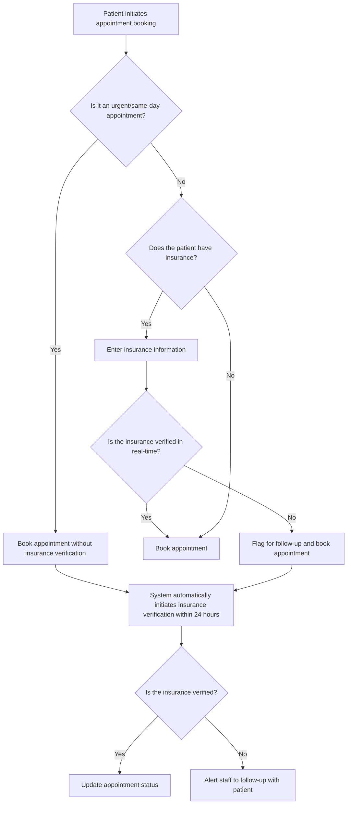
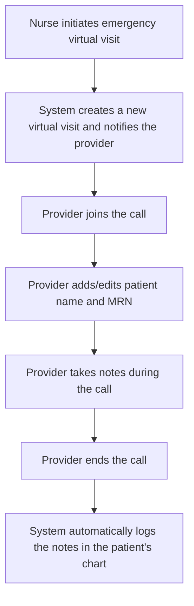
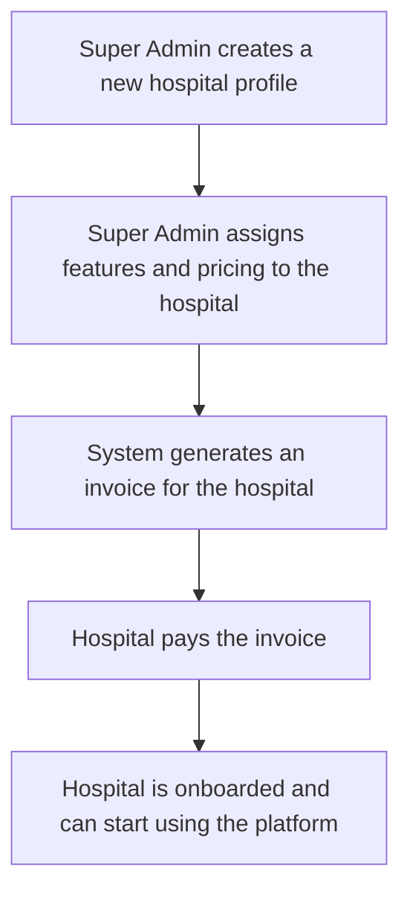

# Mediverse Telehealth Platform - Flowcharts

## 1. Appointment Booking Flow



## 2. Emergency Telehealth Flow



## 3. Hospital Onboarding Flow



## 4. Call Center/PBX Integration Flow

```mermaid
graph TD
    A[Call received on RingCentral/GetWeave number] --> B[Webhook sent to Mediverse backend];
    B --> C{Is the caller's number in the patient database?};
    C -- Yes --> D[Send real-time push to Hospital Admin/Doctor];
    D --> E[Popup appears in web portal with patient info];
    C -- No --> F[Log call without patient info];
    subgraph After Call
    G[Call ends] --> H[Log call with duration, agent name, and notes];
    H --> I[Store call recording link (HIPAA compliant)];
    end
```
