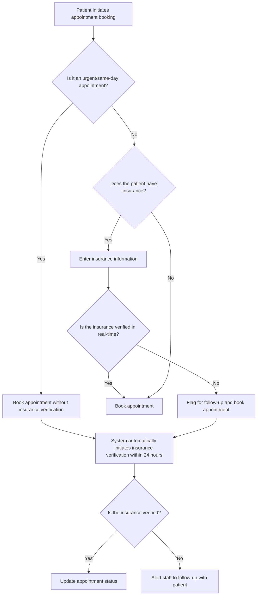
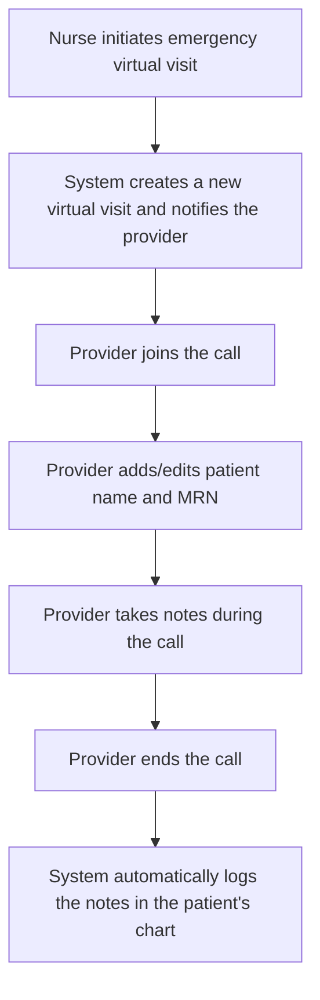
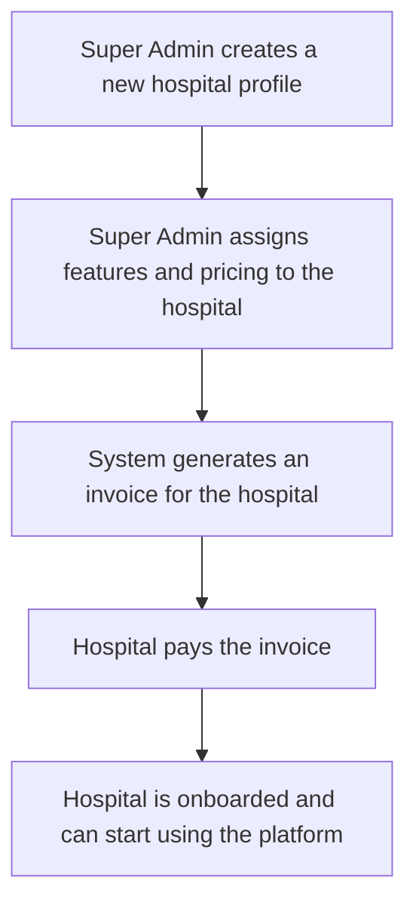

# Mediverse Telehealth Platform - Discovery Documentation

## 1. Introduction

This document provides a comprehensive overview of the discovery phase for the Mediverse Telehealth Platform. It consolidates all the requirements, decisions, and plans that have been made, and serves as the single source of truth for the project's scope.

## 2. Project Requirements

### 2.1. Insurance Verification

*   **API Integration:** The platform will be integrated with the pVerify API for real-time insurance eligibility verification.
*   **Conditional Booking:**
    *   Patients will be allowed to book urgent/same-day appointments without insurance verification.
    *   Insurance confirmation will be required for non-urgent appointments booked >24 hours in advance.
    *   Unverified bookings will be flagged for follow-up.
*   **Post-Booking Verification:**
    *   The system will automatically initiate insurance verification for unverified bookings within 24 hours.
    *   Staff will be alerted of failed verifications via the dashboard and webhooks.

### 2.2. Prescription Management

*   **API Integration:** The platform will be integrated with the DoseSpot API for e-prescribing, including drug database access and submission to pharmacies.
*   **E-Prescribing Workflow:** Providers will be able to electronically prescribe medications to patients during or after a virtual consultation.

### 2.3. Video Calling Service

*   **API Integration:** The platform will be integrated with the Agora API for high-quality, HIPAA-compliant video calling.
*   **Customizable UI:** The video calling interface will be customizable to match the Mediverse brand and to include features such as screen sharing, chat, and recording.

### 2.4. Emergency Telehealth Use Case

*   **Nurse-Initiated Visits:** Nurses will be able to initiate emergency virtual visits for patients.
*   **Real-Time Data Entry:** During the call, providers will be able to add/edit the patient's name, MRN, and notes, which will be automatically logged in the patient's chart.

### 2.5. Hospital Onboarding Use Case

*   **Super Admin Role:** A Super Admin will be able to create and manage hospital profiles.
*   **Feature & Pricing Assignment:** The Super Admin will be able to assign specific features and pricing plans to each hospital.
*   **Invoice-Based Billing:** The system will be able to generate invoices for large hospitals.
*   **Stripe Integration:** The platform will be integrated with Stripe to process patient co-pays.

### 2.6. Post-MVP Features

*   **Role-Based Access Control (RBAC):** The platform will have a robust RBAC system to ensure that users only have access to the features and data that are relevant to their role.
*   **Multiple Delegation Levels:** Users will be able to delegate their responsibilities to other users.

### 2.7. Call Center/PBX Integration

*   **Phase 1 Use Cases:** Call Logging & Contextual Notes.
*   **Real-Time Popups:** Doctors and Hospital Admins will receive real-time popups.
*   **Call Logging:** All calls will be logged automatically, in compliance with HIPAA.
*   **Call Recording:** Call recording will be included in the MVP, in compliance with HIPAA.

### 2.8. Review Management System

*   **Review Collection:** Reviews will be collected per doctor and per hospital.
*   **External Publication:** The possibility of publishing reviews externally will be considered for a future release.
*   **Prompt Channels:** Patients will be prompted to leave a review via in-app notifications and SMS.

## 3. Flowcharts

### 3.1. Appointment Booking Flow



### 3.2. Emergency Telehealth Flow



### 3.3. Hospital Onboarding Flow



### 3.4. Call Center/PBX Integration Flow

```mermaid
graph TD
    A[Call received on RingCentral/GetWeave number] --> B[Webhook sent to Mediverse backend];
    B --> C{Is the caller's number in the patient database?};
    C -- Yes --> D[Send real-time push to Hospital Admin/Doctor];
    D --> E[Popup appears in web portal with patient info];
    C -- No --> F[Log call without patient info];
    subgraph After Call
    G[Call ends] --> H[Log call with duration, agent name, and notes];
    H --> I[Store call recording link (HIPAA compliant)];
    end
```

## 4. Use Cases

### 4.1. Insurance Verification

*   **UC-1.1: Real-Time Insurance Verification:** As a patient, I want to be able to enter my insurance information and have it verified in real-time so that I know what my co-pay will be before I book an appointment.
*   **UC-1.2: Conditional Booking:** As a patient, I want to be able to book an urgent appointment without having to provide my insurance information so that I can get the care I need as quickly as possible.
*   **UC-1.3: Post-Booking Verification:** As a staff member, I want to be alerted when a patient's insurance verification fails so that I can follow up with them to get the correct information.

### 4.2. Prescription Management

*   **UC-2.1: E-Prescribing:** As a provider, I want to be able to electronically prescribe medications to my patients so that they can easily pick them up from their preferred pharmacy.

### 4.3. Video Calling Service

*   **UC-3.1: High-Quality Video Calling:** As a patient, I want to have a high-quality video calling experience so that I can clearly see and hear my provider.
*   **UC-3.2: HIPAA-Compliant Video Calling:** As a provider, I want to use a HIPAA-compliant video calling service so that I can be sure that my patients' privacy is protected.

### 4.4. Emergency Telehealth Use Case

*   **UC-4.1: Nurse-Initiated Visits:** As a nurse, I want to be able to initiate an emergency virtual visit for a patient so that they can get the care they need as quickly as possible.
*   **UC-4.2: Real-Time Data Entry:** As a provider, I want to be able to add/edit a patient's name, MRN, and notes during a virtual visit so that I can keep their medical record up-to-date.

### 4.5. Hospital Onboarding Use Case

*   **UC-5.1: Hospital Profile Management:** As a Super Admin, I want to be able to create and manage hospital profiles so that I can easily onboard new hospitals to the platform.
*   **UC-5.2: Feature & Pricing Assignment:** As a Super Admin, I want to be able to assign specific features and pricing plans to each hospital so that I can customize the platform to meet their needs.
*   **UC-5.3: Invoice-Based Billing:** As a Super Admin, I want to be able to generate invoices for large hospitals so that I can easily bill them for their usage of the platform.
*   **UC-5.4: Stripe Integration:** As a patient, I want to be able to pay my co-pay using Stripe so that I can easily and securely make a payment.

### 4.6. Call Center/PBX Integration

*   **UC-6.1: Real-Time Caller Identification:** As a Hospital Admin or Doctor, I want to see a real-time popup with the patient's information when I receive a call so that I can provide better service.
*   **UC-6.2: Call Logging:** As a Hospital Admin or Doctor, I want all calls to be logged automatically so that I have a complete record of all patient interactions.
*   **UC-6.3: Call Recording:** As a Hospital Admin or Doctor, I want all calls to be recorded so that I can review them for quality assurance and training purposes.

### 4.7. Review Management System

*   **UC-7.1: Review Collection:** As a Hospital Admin, I want to be able to collect reviews from patients for both the hospital and the doctors so that I can get feedback on the quality of our services.
*   **UC-7.2: Review Prompt:** As a patient, I want to receive a prompt to leave a review after my appointment so that I can easily share my feedback.

## 5. Final Quote & Timelines

### 5.1. Project Quote

| Feature | Estimated Cost (USD) |
| --- | --- |
| Insurance Verification (pVerify Integration) | $5,000 |
| Prescription Management (DoseSpot Integration) | $7,500 |
| Video Calling Service (Agora Integration) | $10,000 |
| Emergency Telehealth & Hospital Onboarding | $15,000 |
| Call Center/PBX Integration | $10,000 |
| Review Management System | $5,000 |
| Post-MVP Features (RBAC & Delegation) | $12,500 |
| **Total** | **$65,000** |

### 5.2. Project Timeline

| Phase | Duration (Weeks) |
| --- | --- |
| **Phase 1: Core Feature Implementation** | |
| Insurance Verification | 2 |
| Prescription Management | 3 |
| Video Calling Service | 4 |
| **Phase 2: New Use Case Implementation** | |
| Emergency Telehealth & Hospital Onboarding | 6 |
| Call Center/PBX Integration | 4 |
| Review Management System | 2 |
| **Phase 3: Post-MVP Feature Implementation** | |
| RBAC & Delegation | 5 |
| **Total** | **26** |

**Note:** This is an estimated timeline and may be subject to change based on the complexity of the implementation and the availability of resources.
