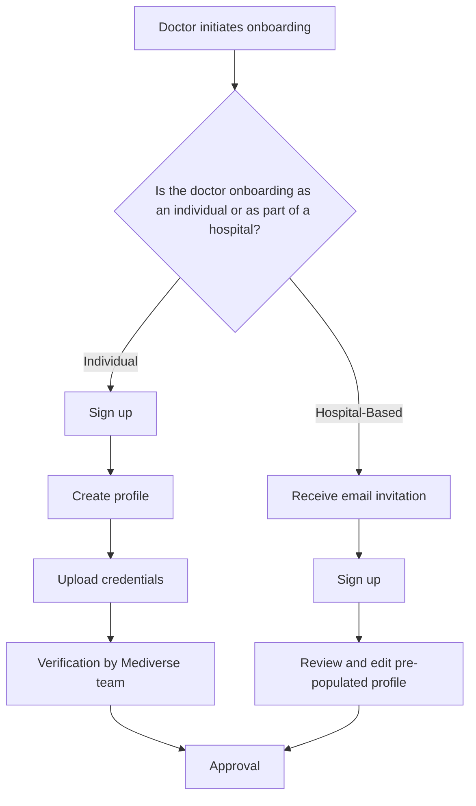

# Mediverse Platform Documentation

## 1. Project Vision

The Mediverse platform will be developed as a **Doctor-Centric Marketplace**. The primary goal of this platform is to connect patients with doctors directly, allowing them to search for, book, and manage appointments in a seamless manner.

## 2. User Journeys

### 2.1. Patient Journey

The patient's interaction with the platform will follow a clear and intuitive path:

1.  **Search:** The patient uses the search and filter functions to find a doctor that meets their needs.
2.  **Discover:** The patient reviews detailed doctor profiles to make an informed decision.
3.  **Book:** The patient selects an available time slot and books their appointment.
4.  **Manage:** The patient uses their personal dashboard to manage their appointments, view their health records, and update their profile.

<h4>Search Page</h4>

<h4>Doctor Profile</h4>

<h4>Booking Flow</h4>

<h4>Patient Dashboard</h4>

<h4>Feedback Form</h4>

### 2.2. Doctor Journey

<h4>Profile Management</h4>

<h4>Schedule Management</h4>

<h4>Appointment Calendar</h4>

### 2.3. Super Admin Journey

<h4>Doctor Onboarding</h4>

<h4>Platform Management</h4>

<h4>Reporting Dashboard</h4>

## 3. Doctor Onboarding

### 3.1. Onboarding Process

#### 3.1.1. Individual Doctor Onboarding

1.  **Sign Up:** The doctor signs up on the Mediverse platform by providing their basic information, including their name, email address, and password.
2.  **Profile Creation:** The doctor creates their professional profile, including their specialties, experience, and hospital affiliations.
3.  **Credential Verification:** The doctor uploads their credentials for verification by the Mediverse team.
4.  **Approval:** Once their credentials have been verified, the doctor is approved and their profile is made public on the platform.

#### 3.1.2. Hospital-Based Doctor Onboarding

1.  **Invitation:** The hospital admin invites the doctor to join the Mediverse platform via email.
2.  **Sign Up:** The doctor clicks on the link in the email and signs up on the platform.
3.  **Profile Creation:** The doctor's profile is pre-populated with the information provided by the hospital. The doctor can review and edit their profile as needed.
4.  **Approval:** The doctor is automatically approved and their profile is made public on the platform.

#### 3.1.3. Onboarding Flowchart

### 3.2. Registration Clash Analysis

#### 3.2.1. The Problem

A potential conflict arises when a doctor who has already registered on the platform as an individual is subsequently invited to join by a hospital. This can lead to duplicate accounts, confusion for patients, and administrative overhead.

#### 3.2.2. Analysis

##### 3.2.2.1. Pros of Allowing Duplicate Registrations

*   **Flexibility:** Doctors can maintain separate profiles for their private practice and their hospital affiliations.
*   **Simplicity:** No need to implement complex logic to prevent duplicate registrations.

##### 3.2.2.2. Cons of Allowing Duplicate Registrations

*   **Patient Confusion:** Patients may be confused by seeing multiple profiles for the same doctor.
*   **Administrative Overhead:** The Mediverse team will need to manually merge duplicate accounts.
*   **Data Inconsistency:** It can be difficult to keep the information on duplicate profiles consistent.

#### 3.2.3. Proposed Solution

To prevent duplicate registrations and manage potential conflicts, we propose the following solution:

1.  **Unique Identifier:** Use the doctor's email address as a unique identifier.
2.  **Existing Account Check:** When a hospital invites a doctor to join, the system will first check if an account with that email address already exists.
3.  **Link to Hospital:** If an account already exists, the system will prompt the doctor to link their existing account to the hospital.
4.  **Single Profile:** The doctor will maintain a single profile that is associated with both their individual practice and the hospital.
5.  **Profile Merging:** In the event that a duplicate account is created, the Mediverse team will have the ability to merge the two accounts into a single account.

#### 3.2.4. Rationale

This solution provides the best of both worlds. It allows doctors to maintain a single, consistent profile while still giving them the flexibility to associate their profile with multiple practices. It also minimizes patient confusion and administrative overhead.

### 3.3. Edge Case Analysis

#### 3.3.1. Doctor Declines Hospital Invitation

*   **Edge Case:** A doctor who has been invited to join by a hospital declines the invitation.
*   **Solution:** The system will record that the doctor has declined the invitation. The hospital admin will be notified and can choose to resend the invitation at a later date.

#### 3.3.2. Doctor Leaves Hospital

*   **Edge Case:** A doctor who was onboarded as part of a hospital leaves the hospital.
*   **Solution:** The hospital admin can remove the doctor from the hospital's profile. The doctor's individual profile will remain on the platform, but will no longer be associated with the hospital.

#### 3.3.3. Multiple Hospital Affiliations

*   **Edge Case:** A doctor is affiliated with multiple hospitals.
*   **Solution:** The doctor can associate their profile with multiple hospitals. Patients will be able to see all of the doctor's hospital affiliations on their profile.

#### 3.3.4. Incorrect Email Address

*   **Edge Case:** A hospital admin invites a doctor using an incorrect email address.
*   **Solution:** The system will detect that the email address is invalid and will notify the hospital admin. The hospital admin can then correct the email address and resend the invitation.

## 4. Future Scope

### 4.1. Patient Interaction

<h4>Telehealth Sessions</h4>

In the future, the platform will be enhanced to include telehealth sessions, allowing patients and doctors to have virtual consultations. This will include high-quality video and audio, as well as a chat feature.

<h4>Session Notes & E-Prescriptions</h4>

Doctors will be able to write and share session notes with patients, as well as generate and send e-prescriptions directly from the platform.

