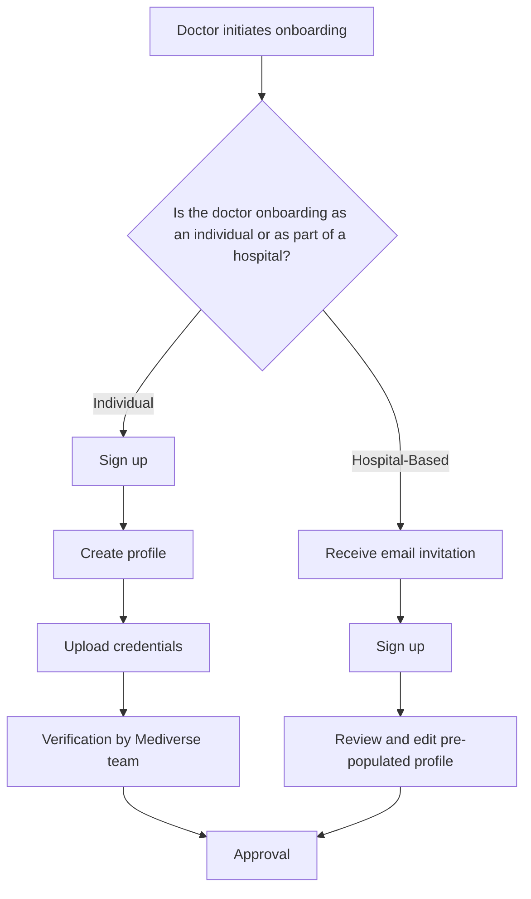

# Doctor Onboarding Process

## 1. Individual Doctor Onboarding

1.  **Sign Up:** The doctor signs up on the Mediverse platform by providing their basic information, including their name, email address, and password.
2.  **Profile Creation:** The doctor creates their professional profile, including their specialties, experience, and hospital affiliations.
3.  **Credential Verification:** The doctor uploads their credentials for verification by the Mediverse team.
4.  **Approval:** Once their credentials have been verified, the doctor is approved and their profile is made public on the platform.

## 2. Hospital-Based Doctor Onboarding

1.  **Invitation:** The hospital admin invites the doctor to join the Mediverse platform via email.
2.  **Sign Up:** The doctor clicks on the link in the email and signs up on the platform.
3.  **Profile Creation:** The doctor's profile is pre-populated with the information provided by the hospital. The doctor can review and edit their profile as needed.
4.  **Approval:** The doctor is automatically approved and their profile is made public on the platform.

## 3. Onboarding Flowchart

